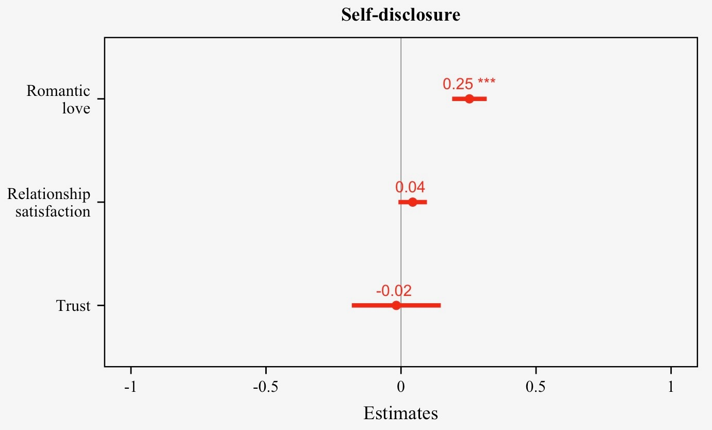
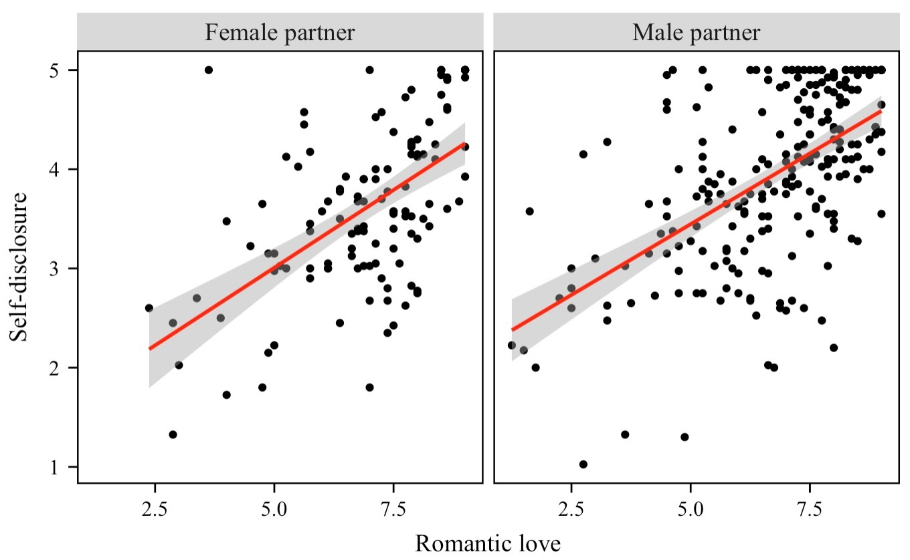
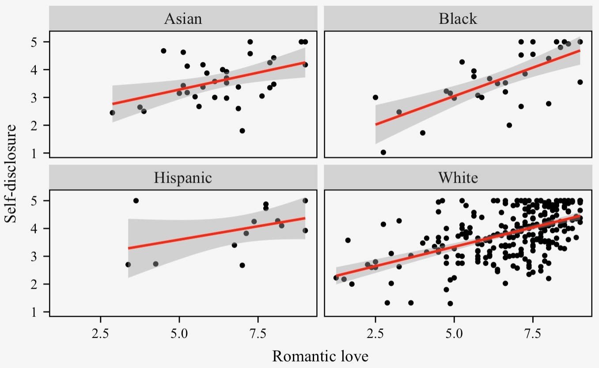

# Psychology Undergraduate Student

### Research Interest
- Stigma against mental illness 😒
- Links between childhood experience and mental illness 👶

### Education
HBSc Psychology Specialist
University of Toronto June 2026 (Expected)

### Work Experience
Community Assistant @Campus One (October 2022 - May 2023)
- Handled emergent situations at a university residence, handed in incident reports, maintained relationships with 100+ students, mediated roommate conflicts while protecting confidentiality
- Proposed, promoted, and executed community events, handed in program evaluations such as tours for prospective residents
- Received “Staff of the Month” award among 2000+ student staff in May 2023

### Project
**Predictors of Self-Disclosure in Romantic Relationships: Love, Trust, or Relationship Satisfaction?**
- Emotional elf-disclosure, or sharing your emotions with others, can bring benefits both to your relationship with your partner and to your own well-being
- While we know that having a strong and healthy relationship encourages people to open up, not much research has looked at how three key parts of a relationship—romantic love, trust, and relationship satisfaction—work together to influence emotional self-disclosure
- This study explores whether these aspects predict how much people share about their emotions and also looks at whether gender and race affect this pattern 
- We used a publicly available dataset called *Self-Disclosure and Health*, collected by Ma (2020), in which 393 participants in relationships, recruited via an online platform, completed an online survey
[Dataset](https://osf.io/bqknw/)
- We tested the relationship between quality of romantic relationship—love, trust and relationship satisfaction—and emotional self-disclosure by using multiple regression

- We found that the more participants loved their partner, the more likely they would open up their emotions to their partners
- But surprisingly, feeling satisfied in a relationship or trusting your partner didn’t seem to influence how much people opened up about their emotions

- We also found that the afformentioned effect is stronger for those with male partners compared to those with female partners

- Lastly, we discovered that this effect is stronger for black participants than those who self-identify as other races
- These findings show how important romantic love is in encouraging people to open up and share about their emotions
- They also highlight how factors like gender and race can shape relationship dynamics
- Programs designed to help people share more emotions in their relationships could be more effective if they consider the unique experiences of different groups

[My md file](https://github.com/tmichioka/My-project/blob/main/My-project.md)

  

