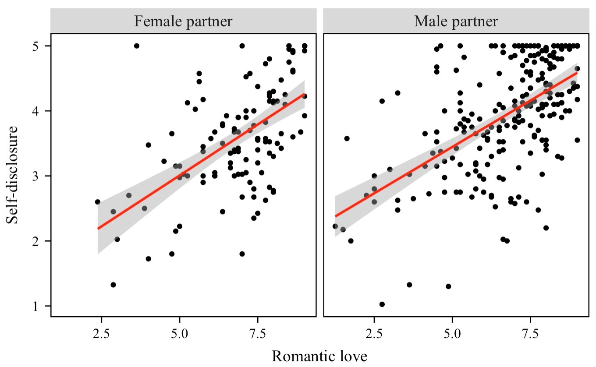

# Psychology Undergraduate Student

### Research Interest
- Stigma against mental illness 😒
- Links between childhood experience and mental illness 👶

### Education
HBSc Psychology Specialist
University of Toronto June 2026 (Expected)

### Work Experience
Community Assistant @Campus One (October 2022 - May 2023)
- Handled emergent situations at a university residence, handed in incident reports, maintained relationships with 100+ students, mediated roommate conflicts while protecting confidentiality
- Proposed, promoted, and executed community events, handed in program evaluations such as tours for prospective residents
- Received “Staff of the Month” award among 2000+ student staff in May 2023

### Project
**Predictors of Self-Disclosure in Romantic Relationships: Love, Trust, or Relationship Satisfaction?**
- Self-disclosure, or sharing personal information about yourself with others, can bring benefits both to your relationship with your partner and to your own well-being
- While we know that having a strong and healthy relationship encourages people to open up, not much research has looked at how three key parts of a relationship—romantic love, trust, and overall satisfaction—work together to influence self-disclosure
- This study explores whether these aspects predict how much people share about themselves and also looks at whether gender and race affect this pattern 
- We used a publicly available dataset called *Self-Disclosure and Health*, collected by Ma (2020), in which 393 participants in relationships completed an online survey.
[Dataset](https://osf.io/bqknw/)

[My Rmd file](https://github.com/tmichioka/My-project/blob/main/My%20project.Rmd)
[My md file](https://github.com/tmichioka/My-project/blob/main/My-project.md)

  

